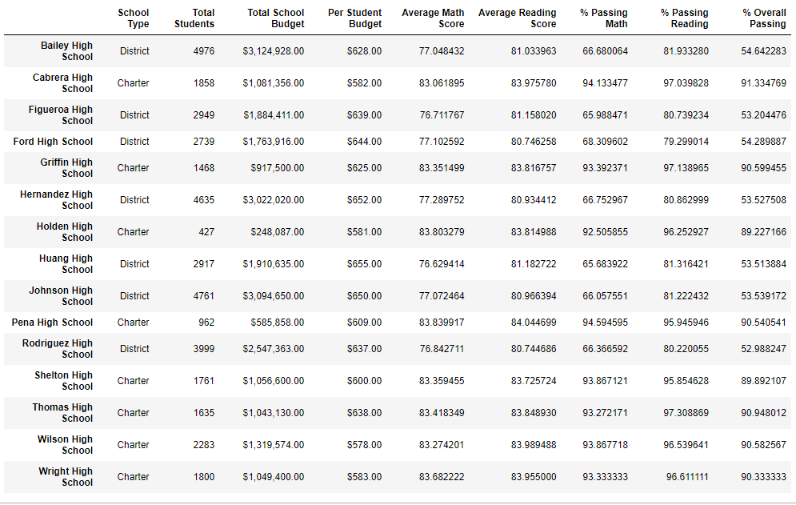
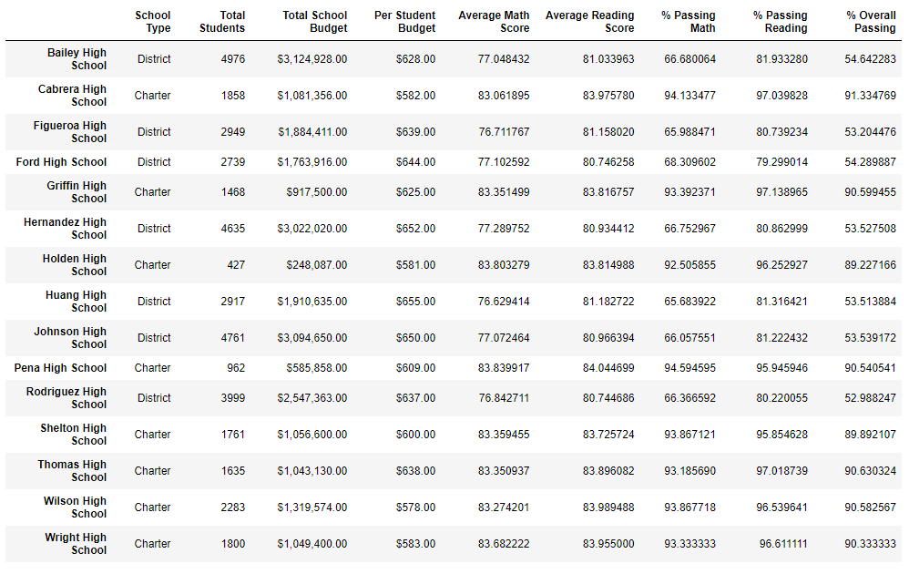

# School District Analysis with Pandas
You can find the Analysis file here: [School_District_Analysis](https://github.com/NedaAJ/School_District_Analysis/blob/main/PyCitySchools_Challenge.ipynby)

## Overview of Analysis
The purpose of this analysis was to remove the inaccurate data from Thomas High School's 9th grades math and reading scores while keeping the rest of dataset intact to perform the same analysis processes done during the module. Here are couple of metrics we analyzed our dataset by:
- *Average Math and Reading Scores*
- *Percentage of students passing Math & Reading exams*
- *Overall Passing Percentage*
- *Total School Budgets*
- *Per Student Budget*

## Results
After removing the Thomas High School 9th grade math and reading scores, majority of our analysis metrics **remained intact** and the same as the original analysis meaning with our dataset being large, removing only a small number of data (461) did not intensely skew our dataset. Here, you can see the result of our original analysis (including Thomas High School 9th grade math and reading scores):

The table you can see below is the result of our most recent analysis, where we removed Thomas High School 9th grade math and reading scores. As you can see, the only results effected by this change of data were the ***percentage of passing*** for ***math*** and ***reading*** and also ***overall passing percentage*** of **Thomas high School**. This means that even with removal of a portion of our data, majority of our results were not impacted and remained nearly the same.

## Summary
The four major changes occured in our analysis are:
- **The Total Number of Students**
- **Thomas High School Total Number of Students**
- **Thomas High School Average Math and Reading Scores**
- **Thomas High School Percentage of Passing students (Math, Reading and Overall)**
The removal of the data has a direct impact on total count of students and total number of students in Thomas High School, more specififcally for this analysis. As the total student count was decreased, there has been a slight change in average scores and percentages, but the changes were minimal. Since th changes to our analysis was minor, it is safe to say that the removal of Thomas High School 9th graders math and reading scores was not as significant. 

## Contact:
- Email : [neda.ahmadi.jesh@gmail.com](mailto:neda.ahmadi.jesh@gmail.com?subject=[GitHub]%20Source%20Han%20Sans)
- Linkedin: www.linkedin.com/in/neda-ahmadi-j
